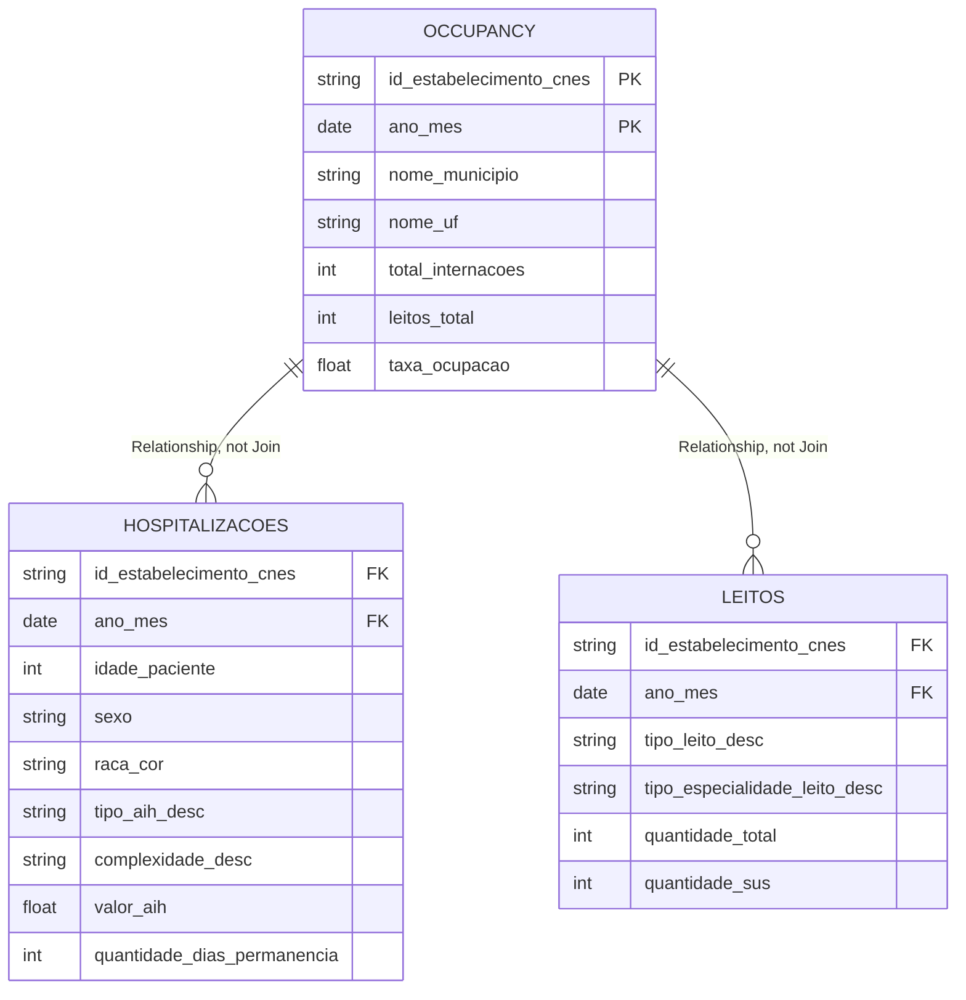

# dv-tug-presentation

Data pipeline for a Tableau User Group (TUG) presentation on gestalt/UX heuristics
in dashboard design. Sources public Brazilian health data (SUS hospitalizations +
hospital bed capacity) and produces a Tableau `.hyper` file. The plan: build this
pipeline and a dashboard briefing, produce an intentionally poor first-version
dashboard from it, then have two UXer co-presenters redesign it principle-by-principle
for the talk.

## Data

- **Source**: [Base dos Dados](https://basedosdados.org/) (public BigQuery datasets)
- **Hospitalizations**: `br_ms_sih.aihs_reduzidas` (SIH-SUS, AIH reduzida records)
- **Bed capacity**: `br_ms_cnes.leito` (CNES)
- **Scope**: Rio Grande do Sul (RS), 2019-2023
- **Occupancy rate** = total bed-days used ÷ (bed count × days in month), joined by
  hospital/month. This is DATASUS's documented approximation, not a true point-in-time
  occupancy rate — values can exceed 100% (bed turnover within a month, etc.). Flag
  this caveat wherever the metric is shown.
- Base dos Dados' free tier lags ~6 months behind current data.

See `CLAUDE.md` for the full data-profiling notes (dead columns, join-key gotchas,
dictionary tables, etc.).

### Tableau data model

`data/refined/sih_cnes_rs.hyper` holds three tables at three different grains. In
Tableau they're connected as **one data source using Relationships** (the logical/
noodle layer, Tableau 2020.2+) on `id_estabelecimento_cnes` + `ano_mes` — **not**
physical Joins. `hospitalizacoes` (one row per admission) and `leitos` (one row per
hospital×month×bed-type) don't share a grain, so a physical join between them would
fan out and silently inflate every sum; `occupancy` is already pre-aggregated to
hospital×month and acts as the safe anchor table. Relationships let each sheet query
only the table(s) its fields need, at that table's native grain, which is also what
makes filters cascade correctly across all three tables from a single V1 dashboard tab.



Field lists above are the fields relevant to the join/grain story, not exhaustive —
`hospitalizacoes` alone carries the full `aihs_reduzidas` column set (109 raw columns)
plus resolved dictionary/geography fields.

The workbook itself lives in `tableau/` (not committed as `.twbx` — see `tableau/README.md`
for why the connection is always Extract, never Live, for a local `.hyper` file).

## Setup

```bash
poetry install
cp .env.example .env   # fill in BD_BILLING_PROJECT_ID with your own GCP project id
```

The first BigQuery call opens a one-time browser OAuth prompt; credentials cache
locally after that. Verify the connection with:

```bash
poetry run python scripts/check_auth.py
```

## Pipeline

Three stages, each reading the previous stage's output from `data/`
(`raw/` → `transformed/` → `refined/`, all gitignored):

```bash
# 0. Geometry: IBGE municipal boundaries -> data/raw/municipios_rs.geojson (free, public API)
poetry run python scripts/fetch_municipal_geometry.py

# 1. Extract: BigQuery -> data/raw/*.parquet
poetry run python scripts/run_extraction.py            # dry run, prints byte estimates only
poetry run python scripts/run_extraction.py --execute   # runs for real (touches billing)

# 2. Transform: join + resolve dictionaries + compute occupancy -> data/transformed/*.parquet
poetry run python scripts/run_transform.py              # local only, no cost

# 3. Refine: finalize tables + export -> data/refined/*.parquet, data/refined/sih_cnes_rs.hyper
poetry run python scripts/run_refine.py                 # local only, no cost
```

Only step 1 touches BigQuery/billing; steps 0, 2 and 3 run entirely locally or against a
free public API.

> **The dry run cannot price the two fact-table queries.** BigQuery returns no byte
> estimate for Base dos Dados tables — verified: Google's own public datasets return a
> figure through the same client, every BD table returns nothing. Step 1's dry run now says
> `ESTIMATE UNAVAILABLE` for those queries rather than silently reporting `0.00 MB`. Size
> them by hand from table metadata instead (`client.get_table()` gives rows and bytes, both
> free to read): `aihs_reduzidas` is 211,6M rows / 128,8 GB across 109 columns ≈ 609 bytes
> per row, so the RS/2019–2023 slice at 22 columns scans roughly 7 GB — about 4 cents at
> $6,25/TiB, and $0 against the 1 TiB monthly free allowance.

### Extract (`src/extract/`)

- `BigQuerySession` — wraps `basedosdados` auth, adds dry-run bytes estimation
- `AihsReduzidasExtractor`, `LeitoExtractor` — the two fact tables, scoped to RS/2019-2023
- `DictionaryExtractor` — code→description lookups (`dicionario` tables)
- `DirectoryExtractor` — `municipio`/`uf` dimension tables
- `IbgeMunicipalGeometry` — municipal boundary polygons from IBGE's public API (not
  BigQuery, so free); validates that the polygon set exactly matches the municipality
  directory before saving, because a choropleth that silently drops municipalities looks
  finished

### Transform (`src/transform/`)

- `DuckDBSession` — local query engine over the raw parquet files
- `DictionaryResolver` — generates the repeated code→description join SQL
- `AihsEnricher`, `LeitoEnricher` — record-level detail + dictionary descriptions + geography
- `OccupancyCalculator` — hospital/month occupancy aggregate, general and ICU
- `bed_type_crosswalk` — maps SIH's 41 `especialidade_leito` codes onto CNES's 7
  `tipo_leito` values, so a per-bed-type rate can put bed-days and registered beds on one
  vocabulary. Documents why ICU is *not* derivable this way (RS uses no ICU specialty
  codes at all) and why ICU days cannot be netted out of ward days (the counter is
  monthly and exceeds total stay days on 11% of ICU admissions)

### Refine (`src/refine/`)

- `OccupancyRefiner`, `HospitalizacoesRefiner`, `LeitosRefiner` — final column cleanup,
  adds a proper `ano_mes` date column for Tableau's date hierarchy
- `HyperExporter` — writes all three tables into one `sih_cnes_rs.hyper` file (via `pantab`)

## Repo structure

- `scripts/` — one-off/exploratory + pipeline entrypoints, run manually, no package
  structure (doubles as a record of how the data was investigated)
- `src/` — reusable pipeline classes (`extract/`, `transform/`, `refine/`)
- `docs/` — briefing and dashboard specs (versioned) — see `docs/README.md` for a
  manifest of what each file contains
- `tableau/` — the actual Tableau workbook(s); `.twb` tracked, `.twbx` gitignored —
  see `tableau/README.md`
- `data/raw|transformed|refined/` — gitignored, never committed
- `references/` — third-party licensed material, gitignored, never committed
- `CLAUDE.md` — full data-profiling notes and working agreement for this project

## Presentation deliverables

See `docs/README.md` for the full manifest (what each file contains, how they relate).
Short version:

- `docs/data_briefing.md` — data briefing for the UX team: what the data can answer,
  which business questions are prioritised, and the caveats that must be surfaced
- `docs/uxers_guidance.md` — the UX co-presenters' own priority filter over the
  Aurélien deck (Fundamentos de Design / Experiência do Usuário / Acessibilidade,
  each with antes/depois examples) — the refinement layer `dashboard_v1_spec.md` builds on
- `docs/dashboard_v1_spec.md` — build spec for the intentionally bad first version:
  page layout (regions N–J), sheet-by-sheet Tableau instructions, and a 46-item ledger
  of which design principle each choice violates (and how the redesign fixes it)
- `docs/dashboard_v1_spec.html` / `docs/dashboard_v1_wireframe.html` — styled,
  browsable companions to the spec: the first is the write-up, the second is a mid/high-fidelity
  navigable mockup with a toggleable per-region diagnostic

Principles come from *Learn Design Driven Data Visualization* (Aurélien Vautier /
Dataviz Clarity, CC BY-NC-ND 4.0) — the PDF lives in the gitignored `references/`.

## Status

- [x] Extraction pipeline (BigQuery → parquet), RS/2019-2023
- [x] Transform pipeline (join, dictionary resolution, occupancy calc)
- [x] Refine pipeline + `.hyper` export
- [x] Dashboard briefing document (`docs/data_briefing.md`)
- [x] Spec for the intentionally poor first-version dashboard (`docs/dashboard_v1_spec.md`),
  refined against the UX co-presenters' own priority pass (`docs/uxers_guidance.md`)
- [x] Mid/high-fidelity wireframe mockup with per-region diagnostic (`docs/dashboard_v1_wireframe.html`)
- [x] Build V1 in Tableau (`tableau/dashboard_v1.twb`) — single data source, three tables
  related (not joined) on `id_estabelecimento_cnes` + `ano_mes`; 21 worksheets assembled
  onto one fixed 1200×2600 dashboard, with all 11 region-I filters placed across their
  six spec'd blocks
- [x] Scope the region-I filters — 8 of 11 now apply to selected worksheets, 3 stay global.
  Scoping is deliberately approximate versus `docs/dashboard_v1_spec.md` section 6; the
  proximity sin still lands on 8 filters
- [x] Record the as-built deviations (`docs/dashboard_v1_as_built.md`) — filter scope,
  automatic Y axis on the time series, dual-axis line chart, one known legend/pie filter
  mismatch
- [x] V2 foundations — occupancy rate rebuilt as SUS-only and weighted (state rate moves
  30,8% → 55,8%), with numerator and denominator exported separately so it stays correct
  at every drill level; design system + validated Tableau palettes
  (`docs/dashboard_v2_design_system.md`, `tableau/Preferences.tps`)
- [x] V2 build spec (`docs/dashboard_v2_spec.md`) — persona, four-tab architecture at
  1200×800, sheet-by-sheet spec with verified anchor numbers, and the V1-sin → V2-fix
  map that doubles as the workshop script
- [x] V2 wireframe (`docs/dashboard_v2_wireframe.html`) — four navigable tabs at 1200×800,
  KPI tiles with sparklines and YoY context, built entirely from real refined data
- [x] **ICU occupancy, and it inverts the pandemic story** — re-extracted `aihs_reduzidas`
  with 6 more columns (`especialidade_leito`, `tipo_uti`, `tipo_uci`,
  `quantidade_dias_uti_mes`, `quantidade_dias_unidade_intermediaria`, `valor_uti`), giving
  a real ICU rate: **111,9% in 2021 and 131,9% in June 2021, while general occupancy
  *fell* to 53,2%**. A dashboard showing only the aggregate would have reported less
  pressure in 2021 than in 2019. Also adds per-bed-type occupancy via a documented
  SIH→CNES crosswalk (`src/transform/bed_type_crosswalk.py`)
- [x] Regional geography and municipal boundaries — `nome_regiao_saude` (30 in RS),
  `nome_regiao_intermediaria` (8), `nome_microrregiao` (35) and `centroide` now flow
  through the pipeline from the BD directory (no BigQuery needed), and
  `scripts/fetch_municipal_geometry.py` pulls IBGE's 497 municipal polygons for a
  code-joined choropleth. Verified: polygon codes exactly equal the BD directory set
- [x] Palette semantics ratified — blue+orange confirmed, with orange fixed to mean
  "needs attention" and never "most recent" or "median"; type family set to Roboto with a
  documented Arial fallback (`docs/dashboard_v2_design_system.md`, `tableau/Preferences.tps`)
- [x] Dry-run cost reporting no longer lies — `estimate_bytes()` returns `None` for every
  Base dos Dados table (Google's own public datasets return a real figure through the same
  client), and `run_extraction.py` was coercing that to `0`, so dry-run mode printed
  `0.00 MB estimated` for every query. It now reports `ESTIMATE UNAVAILABLE` and warns
  that the total is a floor, not the bill
- [ ] **Next: V2 orientation layer** — the "how do I use this" pass, and the last open
  requirement from `docs/uxers_guidance.md`, whose Nielsen row reads *"dashboard sem
  glossário e sem botão de suporte → dashboard com glossário e botão de suporte"*. Three
  pieces, to be specced together:
  - **Guided tour** — first-run walkthrough of the four tabs, so the reading order is
    taught rather than guessed
  - **How to use it** — what each tab answers, how the filters scope, how to read the
    indexed hero chart (the 100-baseline needs explaining, not just annotating)
  - **Glossary** — user-facing definitions of every metric on screen. Derive it from
    `docs/metrics_dictionary.md`, which is already the definition-of-record; the glossary
    is its public subset, not a second source of truth
- [ ] Build V2 in Tableau (`tableau/dashboard_v2.twb`)

*Capturing the "before" artefacts (screenshots, timings, usability recording) was dropped
from this repo's scope — the UX co-presenters own the presentation materials.*
